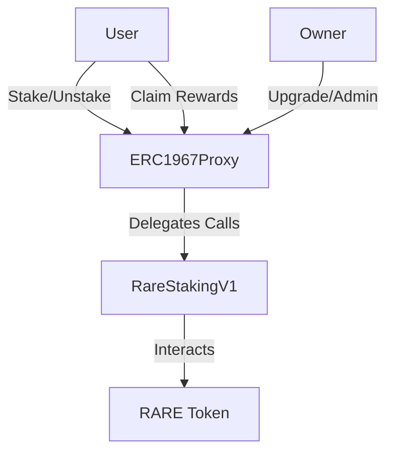

# Rare Staking

A Solidity smart contract implementation for staking RARE tokens with Merkle-based claim functionality and efficient reward distribution. This contract enables users to stake their RARE tokens and participate in a rewards program, with claims validated through Merkle proofs for gas-efficient distribution.

## Architecture

The Rare Staking contract implements a UUPS (Universal Upgradeable Proxy Standard) pattern for upgradeability, combined with a merkle-based claim system for efficient reward distribution. Here's a breakdown of the key components:

### Core Contracts

- `RareStakingV1.sol`: The implementation contract containing the core logic for:
  - Staking and unstaking RARE tokens
  - Merkle-based reward claiming
  - Contract upgradeability
  - Access control

- `ERC1967Proxy.sol`: The proxy contract that:
  - Stores the contract state
  - Delegates all calls to the implementation
  - Enables seamless upgrades without state loss

### Key Features

1. **Upgradeable Architecture**
   - UUPS proxy pattern for future upgrades
   - State persistence across upgrades
   - Owner-controlled upgrade mechanism

2. **Staking Mechanism**
   - Direct RARE token staking
   - Balance tracking per address
   - Total stake accounting
   - Reentrancy protection

3. **Reward Distribution**
   - Merkle-based claim system
   - Gas-efficient reward distribution
   - Round-based claiming
   - Duplicate claim prevention

4. **Security Features**
   - OpenZeppelin's secure contract base
   - Reentrancy guards
   - Access control
   - Input validation

### Contract Interactions


This architecture allows for future upgrades while maintaining the same contract address and state, providing flexibility for protocol improvements and bug fixes.

## Requirements

- [Foundry](https://book.getfoundry.sh/getting-started/installation) - Smart contract development toolkit
- [Git](https://git-scm.com/downloads) - Version control

## Setup

1. Clone the repository and its submodules:
```bash
git clone https://github.com/rareprotocol/rare-staking.git
cd rare-staking
forge install
```

2. Set up your environment variables:
```bash
cp sample.env .env
```
Then edit `.env` with your configuration. The following variables are required:
- `PRIVATE_KEY`: Your deployer wallet's private key
- `RARE_TOKEN`: The address of the RARE token contract
- `INITIAL_MERKLE_ROOT`: The initial Merkle root for claims

See `sample.env` for all available configuration options.

## Building

To compile the contracts:

```bash
forge build
```

To run tests:

```bash
forge test
```

To run tests with gas reporting:

```bash
forge test --gas-report
```

## Deployment

The deployment script is located in `script/DeployRareStake.s.sol`. To deploy the contract:

1. Ensure your `.env` file is properly configured with:
   - `PRIVATE_KEY`: Your deployer wallet's private key
   - `RARE_TOKEN`: The address of the RARE token contract
   - `INITIAL_MERKLE_ROOT`: The initial Merkle root for claims

2. Run the deployment script:

For local testing:
```bash
forge script script/DeployRareStake.s.sol --rpc-url http://localhost:8545 --broadcast
```

For testnet/mainnet deployment:
```bash
# Build and test before deployment
forge build
forge test

# Deploy with verification
forge script script/DeployRareStake.s.sol \
    --rpc-url <your_rpc_url> \
    --broadcast \
    --verify \
    --etherscan-api-key <YOUR_ETHERSCAN_API_KEY> \
    -vvvv
```

The script will:
1. Deploy the implementation contract (`RareStakingV1`)
2. Deploy the proxy contract pointing to the implementation
3. Initialize the contract with the provided parameters

The proxy contract address should be used for all subsequent interactions with the protocol.

Replace `<your_rpc_url>` with your preferred network RPC URL (e.g., Ethereum mainnet, testnet).

## Project Structure

- `src/`: Smart contract source files
  - `RareStakingV1.sol`: Implementation contract with core logic
  - `interfaces/`: Contract interfaces
- `test/`: Contract test files
- `script/`: Deployment and other scripts
- `lib/`: Dependencies (OpenZeppelin contracts, Forge Standard Library)

## Dependencies

The project uses the following main dependencies:
- OpenZeppelin Contracts (including proxy and upgradeability modules)
- Forge Standard Library

These are managed through Git submodules and Foundry's dependency system.
